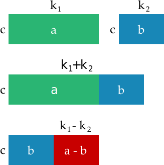

https://ocw.mit.edu/courses/mathematics/18-781-theory-of-numbers-spring-2012/lecture-notes/
http://www.math.uconn.edu/~kconrad/blurbs/ugradnumthy/modarith.pdf

# Divisibility
thm. using jugs of water:
for some jug with "a" gallons, and another with "b" gallons, assuming a >= b
if m|a, and m|b, then m|(any possible jug filling)

## Number theory
- what is it? what is a number?

**Successor Operation** - Fundamental operation for natural numbers:
$$s(n) = n + 1$$
Addition then becomes repeated applications of successor, multiplication is repeated addition

**Principle of Mathematical Induction (PMI)** - For property \\(p(n)\\) true or
  false, if 1. \\(P(1)\\) true and 2. \\(P(n) ⇒ P(n + 1) \\), then \\(P(n)\\) true for all natural
  numbers
  
**Well Ordering Principle (WOP)** - Every nonempty subset of natural numbers has a smallest element. PMI and WOP are equivalent - each follows from the other

**Divisibility** - Say a|b if b = ax for a, b, x ∈ Z and a = 0

//todo: while showing rectangles, bring back point that these are units of units (number theory thinking).
// divisibility then is arranging units into rectangles

// apples are good example? small apples, big apples, still apples. half apple? either two apple bits or not considered one of the units allowed in the computation.

// > n = qm + r
   n: dividend
   m: divisor / modulus
   q: quotient (normally don't care about it)
   r: remaider / residue -> 0 <= r < m
   
   how to solve modular arithmetic? (khan academy problems)

> lemma gcd(n,p) = 1 i.e. iff p does not divide n
  
> prove if a \equiv r mod m and b \equiv r mod m then m|(a-b)

congruence and divisibility are PREDICATES not operators
mod operator / remainder operator (%) and division are operators

> show how ab \equiv r mod m = a \mod m * b mod m (same for addition)

*division* not defined in modular arithmetic world. 15/3 \equiv 3/3 (mod 6) why not?

how about exponentiation?
3^14 mod 7 ? = 2 (correct)
3^{14 mod 7} mod 7 ? 1 (wrong!)
eulers totient theorem shows we need:
3^{14 mod phi(7)} mod 7 ? 2 (correct)

why is 6! divisible by 9? because it has a 3 and 6 as factor. (9|(3*6))
# Divisibility 
What does it mean that a number \\(a\\) is divisible by \\(b\\) ?

what is a number from the point of number theory?
numbers as mathematical objects, once you define what the unit is, a thing is a thing. how many things? (image of things)

### Problem
> how many people before the difference in age is a exactly some multiple of a year?
> is it true that for any four numbers a,b,c,d that there are two of them who difference is divisible by 3?

pigeon hole principle.
It means that \\(a\\) can be represented as \\(b \times q \text{ where } q \in \mathbb{Z} \\)

> note: by this definition \\(0 \\text{ divides } 0 \\) because \\( 0 = 0 \times q \\text{ for all } q\\)
trivial to prove with empty rectang

> show 1 divides any n, so we can consider it trivial. related to primes.

> todo: provide algebraic and then geometric intuitions

imagine the bar as the edge of the rectangle, then a lot of the lemmas become more intuitive.
 imagine as tetris, then more intuitive concept of remainder.

> explain we can assume both positive, because translating from negative to positive is trivial (show)
(same *set* of divisors) 

$$ b \mid a \text{ iff } a = b \times q \text{ where } q \in \\{ ...,-2,-1,0,1,2,-2,... \\} $$
> note this is how to think or visualize whenever you get a divisibility. convert it to its a = mq + r, note that the q is usually the bit we care most about, and it can be "some q"

if \\(b \mid a \\) then \\(b \\mid a \times q \\).

Then also if \\(c \mid a \\) and \\(c \mid b \\) then \\(c \mid a \pm b \\):

\\(a = q \times b + r \\) where \\(0 \le r < b\\)

if \\(r = 0 \\) then \\(a = q \times b \\) and therefore \\(b \mid a \\). todo: explain why r can be zero but not b and not greater than b.

\\(m \bmod b = n \bmod b \\) iff \\(b \mid (m + n) \\)
> todo: prove in both directions
> todo: relate to problem "is it true that for any four distinct numbers a,b,c,d that there are two of them who difference is divisible by 3"

### divisibility by 10
go through simple examples

### divisibility by 2
special case, b = 2. then only 2 possible remainders: 0 and 1.

we have special names for numbers with these remainders: even and odd.

> problem: two classes with m and n students. they join, can we split into pairs if a,b odd/even etc. case both even, both odd, odd/even (use above a-b if same remainder lemma)

for even numbers show that remainder (a - b) mod 2 = (a + b) mod 2

show how can do for products (2 | a + a + a + ... + a) is still divisible by a (above lemma)

build \\( \\pm \\) table and product table for 2

| \\( \pm \\) | 0 | 1 |
|-------------|---|---|
|0            | 0 | 1 |
|1            | 1 | 0 |

`XOR` ?

| \\( \times \\) | 0 | 1 |
|----------------|---|---|
|0               | 0 | 0 |
|1               | 0 | 1 |

`AND` ?

> What is the remainder of \\( 374 \times (419 + 267 \times 38) - 625 \\) when divided by 2?  

trick (explain above) we can operate with their remainders instead of their value.

\\[ \begin{aligned}
&\Big(374 \times (419 + 267 \times 38) - 625 \Big) \bmod 2 \\\\
&= \Big((374 \bmod 2) \times \big( (419 \bmod 2) + (267 \bmod 2) \times (38 \bmod 2)\big) - (625 \bmod 2)\Big) \bmod 2 \\\\
&= \Big(0 \times ( 1 + 1 \times 0) - 1\Big) \bmod 2 \\\\
&= \Big(0 - 1\Big) \bmod 2 \\\\
&= 1
\end{aligned} \\]

### Congruence

> what is the remainder of \\( 17 \times (12 \times 19 + 5) - 23 \\) when divided by 3?

can substitute with congruent numbers (not just remainder, e.g. -1 is congruent to 2 modulo 3)
### All that remains

two numbers \\(a\\) and \\(b\\) are **congruent modulo \\(m\\)** if they have the same remainder when divided by \\(m\\)

\\(a \equiv b \mod m\\)

as we discuss, \\(a \equiv b (\bmod m)\\) iff \\(a-b\\) is divisible by \\(m\\)

> note: iff can be counterintuitive if you read as a conditional, another way is to treat it as a double sided implication, i.e:
if \\(a \equiv b (\bmod m)\\) then \\(a-b\\) is divisible by \\(m\\) and vica versa

Note that then \\(a \equiv b (\bmod m)\\) iff \\((a +k \times m) \equiv b (\bmod m)\\)

This means that if \\(a = m \times q + r\\) then \\(a \equiv r (\bmod m)\\)

### addition of constant

> if \\( a \equiv b (\\bmod m) \\) then \\(a + c \equiv b + c (\\bmod m) \\) for any \\(c\\)
prove visually, prove algebraicly, prove with lemma \\(m \mid (a-b)\\) and \\(a+c) - (b-c) = a-b\\)

### addition
> if \\( a \equiv b (\\bmod m) \\) and \\( c \equiv d (\\bmod m) \\)  then \\(a + c \equiv b + d (\\bmod m) \\)
"congruence is preserved under addition"

> what is \\(14 + 41 + 20 + 13 + 29 \\) when divided by 4

### multiplication
> if \\( a \equiv b (\\bmod m) \\) and \\( c \equiv d (\\bmod m) \\)  then \\(a \times c \equiv b \times d (\\bmod m) \\)
"congruence preserved under multiplication"

> what are the last two digits of \\(99^{99}\\)
trick \\(99 \equiv -1 (\bmod 100)\\)

> is 3475 divisible by 3?

### modular addition table
is subtraction possible?
> suppose we have two numbers \\(a\\) and \\(b\\). Is there \\(x\\) such that \\(a + x \equiv b (\bmod 7) \\)? 

simple proof, each row conatins each possible remainder. pigeonhole principle for a and x must be one of the rows/cols, there will be a b
prove not just true for 7, but any module

### modular multiplication table
the ones! there are no ones (except 1...) unless there are fractions (rational numbers) or modular arithmetic 
- for mod 7, same logic, division must exist (where a != 0), but no... for mod 6

modular division... is more complicated... (diaphantine equations...)

for division (i.e a = 1 mod m) explain that division is really just... inverse of multiplication. which means, some identy number is the result. reach for identity and inverse definitions as generalized cases. show how this is useful because it allows us to cancel out, when the product is 1.

> proving gcd(a,b) = 1 iff ab is invertable (can be divided) is this ok?
gcd(a,m) = 1
- sequence: {0a, 1a, 2a, ... (m-1)a}
- pick 2 (not congruent mod m)
- can xa \equiv ya mod m?
- means m|(x-y)a 
- means m|(x-y)
- but -m < (x-y) < m and x-y not zero
- therefore, they are all different mod m
- pigeonhole principle: one must be 1.
otherway around too... https://www.coursera.org/learn/mathematical-foundations-cryptography/lecture/mT0D3/multiplicative-inverses

is it bad? well, if math was about computing things like the problems thus far... yes. but things being hard can be good too (cryptography!)

# Binary (quickie) article
> show that \\( a\bmod b \\) is same the last digit as \\(a_{\text{base }b}\\)
in this way there is a deeper relationship to bases (radix) and remainders / divisibility

how to prove that binary system can represent every number and that it is a bijection? (find proof by induction)

> Problem: how many bits required to represent a given number \\(a\\)

show that \\(2^n) requires \\(n+1\\) bits and is the smallest number requiring that many bits:
prove \\(2^n - 1 = 2^{n-1} + 2^{n-2} + ... + 2^0 \\) which has a length of n.

then show the answer is:

largest \\(n\\) such that \\(2^{n-1} \le a\\)
 
show how this relates to logarithms (and the shift proof in gopher forth)

number of bits is \\(\lfloor \log_2{a} \rfloor + 1\\)

(can prove directly, observing that the floor operator is same as "largest integer n that is less than or equal to, pretty cool, gives a new intuition to the floor/round down operator)

> lemma: if we take all the multiples of a, from 1a to (p-1)a for some prime p, and if we then express each multiple in the form mp + r, every remainder will be unique. and will be a permutation of {1,...,p-1} [1,p-1]:
example:  (if 0 < a < p)
  p = 7, a = 4
  4 \times {1,2,3,4,5,6} = {4,8,12,16,20,24}
  {4,8,12,16,20,24} mod p = {4,1,5,2,6,3} which is a permutation of {1,2,3,4,5,6}

(proof) suppose two elements from remainder set r1,r2 are equal.
then:
ai - aj  &= (sp + r1) - (tp + r2) 
a(i - j) &= (s - t)p

since i and j are less than p (i-j) is less than p. let (i-j) = b, then:
 ab = (s-t)p
or
p|ab
which cannot be true.
therefore the remainders cannot be the same.

another proof view:
1. pick a prime                                         e.g. p = 7
2. consider set S = 1,2,...,(p-1)                       e.g. S = {1,2,3,4,5,6}
3. pick any a, such that p does not divide a            e.g. a = 4
4. notice that a and p are therefore co-prime           e.g. gcd(a,p) = 1
5. therefore there exists x,y such that ax + py = 1
5. therefore ax = 1 mod p
5. x exists and is the multiplicative inverse of a mod p 
5. multiplication by a is invertible mod p
5. multiply each element in S by "a" mod p              e.g S' = {4,8,12,16,20,24} mod 7 = {4,1,5,2,6,3}
6. (??) need to show that no NEW elements possible, because mod p, only "new" element possible would be zero
 -> need to show that because p does not divide a, cannot be zero. not sure yet how tho...
6. because invertible, function must be one-to-one and onto
7. show repeated applications of a and show MUST be cycle. r -> ar -> a2r -> a3r -> ... -> r
  -> because maximum unique entries is p-1
  -> because cannot be not a cycle, or a node would have more than one edge inward, making it not invertible.
8. therefore there is some c such that a^c * r = r mod p 
  -> if r was 0, then a^c * 0 = 0 mod p for ANY a,c,p
  -> we know that r is not zero (??? damn, need this fact twice now!) how can product of two things be zero? means cannot escape, because any future prodyct would also be zero??
  -> which means p | (a^c*r - r)
  -> which means p | (a^c - 1)r
  -> which means p divides (a^c - 1) OR p | r
  -> because r < p and r > 0, p does NOT divide r
  -> which means p | (a^c - 1)
  -> which means pk = a^c - 1
  -> which means a^c - pk = 1
  -> which means a^c = 1 mod p (phewwww! we needed a lot of stuff to get here...
1. notice c is the length of the cycle
1. choose another r, and repeat. we know that a^c = 1 mod p, so it will take a^c to complete a cycle.
1. so we know, that these two cycles cannot contain shared elements, and are the same length.
1. if we repeat for all elements of r, we must have some number of cycles n.
1. then c*n = p-1
drumroll....
1. a^(p-1) = a^(cn) = (a^c)^n = 1^n mod p = 1 mod p.

p | n^p - n
pk = n^p - n
n^p - pk = n
n^p = n mod p 
n^{p-1} = 1 mod p <can divide by n iff gcd(n,p) = 1 i.e. if p does not divide n>

> merry go round question. how many different trains make a colored merry go round?

# goals:

1. understand number as mathematical structure
1. understand n = mq+r
1. understand (mod) congruence
1. convert between n = mq+r and n = r (mod m)
1. intuition for associativity, commutivity
1. intuition for preservation of congruence over addition, subtraction, multiplication
1. explain that division is not always defined
1. convert between ax + by = c to ax = c (mod b)

# GCD
> need to discuss gcd(a,b) = 1 (factors are disjoint) this is so important going forward
> Every common divisor of a and b divides gcd(a, b).
> If gcd(a, b) = 1 and gcd(a, c) = 1, then gcd(a, bc) = 1.
> If a | bc and gcd(a, b) = 1, then a | c
> gcd(0,1) = 1 implies 0 is co-prime with 1.
> gcd is an essential operation for computing inverses modulo: find an integer k such that n \\(ak \equiv 1 \bmod n\\)
> gcd(0,0) would be infinitely large, because all integers satisfy, so is undefined - better, infinity is not in the set, so it is not "infitely large" it is undefined, because for any integer, you can always find a greater one. contrast with well ordering principle as "the set of positive integers has no largest element"
> todo: use shortest side of rectangle for intuition for difference algorithm
