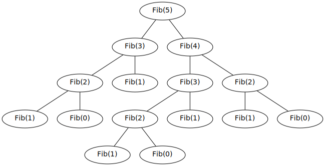

### Recursive implementation

```go
type Fib func(n int) int

func FibNaive(n int) int {
    if n < 2 {
        return n
    }
    
    return FibNaive(n-1) + FibNaive(n-2)
}
```

| \\( n \\)   | `FibNaive`         |
|-------------|--------------------|
| \\( 12 \\)  | 1,150 ns/op        |
| \\( 40 \\)  | 816,681,704 ns/op  |
| \\( 90 \\)  | too long           |

### Improvement: Remember what you saw here



```go
func FibCached(n int) int {
  return FibCacheAux(n, make(map[int]int))
}

func FibCacheAux(n int, cache map[int]int) int {
  if n < 2 {
    return n
  }

  a, cached := cache[n-1]
  if !cached {
    a = FibCacheAux(n-1, cache)
  }

  b, cached := cache[n-2]
  if !cached {
    b = FibCacheAux(n-2, cache)
  }

  result := a + b
  cache[n] = result

  return result
}
```


| \\( n \\)   | `FibNaive`         |`FibCached`   |
|-------------|--------------------|--------------|
| \\( 12 \\)  | 1,150 ns/op        | 1,092 ns/op  |
| \\( 40 \\)  | 816,681,704 ns/op  | 6,044 ns/op  |
| \\( 90 \\)  | too long           | 15,979 ns/op |

### Can we do better? Tail recursion revisited
> todo

\\[ \\begin{aligned}
F_0 &= 0 \\\\
F_1 &= 1 \\\\
F_n &= \sum G_n \\\\
\\end{aligned} \\]

where \\( G_n \\) is the an auxillary function returning the tuple \\( \begin{pmatrix} F\_{n-1} \\\ F\_{n-2} \end{pmatrix} \\) and we define \\( \sum G_n \\) as the sum of its components, i.e:

$$ \sum G_n = \sum \begin{pmatrix} F\_{n-1} \\\ F\_{n-2} \end{pmatrix} = F\_{n-1} + F\_{n-2} $$

We can see how this new function behaves by examining \\(G(n+1)\\)

\\[
G_{n+1} = \begin{pmatrix} F\_{n} \\\ F\_{n-1} \end{pmatrix} = \begin{pmatrix} F\_{n-2} + F\_{n-1} \\\ F\_{n-1} \end{pmatrix}
\\]

Thus we can see it is completely determined by its previous term, that is:
 
 $$ \\text{if } G_n = \begin{pmatrix} a \\\ b \end{pmatrix} \\text{ then } G\_{n+1} = \begin{pmatrix} a + b \\\ a \end{pmatrix} $$ 

This would give the sequence:

$$ G := \begin{pmatrix} 1 \\\ 0 \end{pmatrix}, \begin{pmatrix} 1 \\\ 1 \end{pmatrix}, \begin{pmatrix} 2 \\\ 1 \end{pmatrix}, \begin{pmatrix} 3 \\\ 2 \end{pmatrix}, \begin{pmatrix} 5 \\\ 3 \end{pmatrix}, ... $$

 Given \\(n\\) cannot be smaller than 2, we have our base case \\(G_2 = \begin{pmatrix} 1 \\\ 0 \end{pmatrix} \\)
We can now implement \\(G_n\\) as a recursive auxilary (helper) function as for our new fibonacci solution as follows:

```go
func FibTuple(n int) int {
  if n < 2 {
    return n
  }

  a, b := FibTupleAux(n)

  return a + b
}

func FibTupleAux(n int) (int, int) {
  if n == 2 {
    return 1, 0
  }

  a, b := FibTupleAux(n - 1)

  return a+b, a
}
```

| \\( n \\)   | `FibNaive`         | `FibCached`  | `FibTuple` |
|-------------|--------------------|--------------|------------|
| \\( 12 \\)  | 1,150 ns/op        | 1,092 ns/op  | 35.4 ns/op |
| \\( 40 \\)  | 816,681,704 ns/op  | 6,044 ns/op  | 139 ns/op  |
| \\( 90 \\)  | too long           | 15,979 ns/op | 359 ns/op  |


## Strict tail recursion

plug and chug for n = 5:

> todo: function operating on vectors is a transformation \\(T\\).

We see that our auxillary function is not tail recursive, it does a recursive call which returns the tuple \\( (a,b) \\) but then afterwards there is a deferred operation:

 $$ T:  (a, b) \mapsto  (a+b , a) $$
 
 If we plug and chug through the case where \\(n=5\\) we can get a better feeling for how this is behaving:

\\[ \\begin{aligned}
G_5 &= \\text{Aux}(5) \\\\
     &= g \circ \\text{Aux}(4) \\\\
     &= g \circ g \circ \\text{Aux}(3) \\\\
     &= g \circ g \circ g \circ \\text{Aux}(2) \\\\
     &= g \circ g \circ g(1,0) \\\\
     &= g^{ \circ 3 } (1,0) \\\\
     &= g^{ \circ 2 } (1,1) \\\\
     &= g^{ \circ 1 } (2, 1) \\\\
     &= (3,2)
\\end{aligned} \\]

Which suggests the general case of:

$$ G_n = g^{ \circ n-2 } (1, 0) \text{ where } n \\gt 2 $$

We can write \\(g^{ \circ n }\\) recursively as:

> todo: this is wrong, should be g(n,1,0)

\\[
g(n,a,b) =
\\begin{cases}
  (1,0)      & \\text{if } n = 2 \\\\
  g(n,a+b,a) & \\text{if } n > 2 \\\\
\\end{cases}
\\]

```go
func FibTupleTailRecursive(n int) int {
  if n < 2 {
    return n
  }

  a, b := FibTupleTailRecursiveAux(n, 1, 0)

  return a + b
}

func FibTupleTailRecursiveAux(n int, a int, b int) (int, int) {
  if n == 2 {
    return a, b
  }

  n = n - 1
  a, b = a+b, a
  return FibTupleTailRecursiveAux(n, a, b)
}
```

| \\( n \\)   | `FibNaive`         | `FibCached`  | `FibTuple` | `FibTupleTailRecursive` |
|-------------|--------------------|--------------|------------|-------------------------|
| \\( 12 \\)  | 1,150 ns/op        | 1,092 ns/op  | 35.4 ns/op | 38.9 ns/op              |
| \\( 40 \\)  | 816,681,704 ns/op  | 6,044 ns/op  | 139 ns/op  | 148 ns/op               |
| \\( 90 \\)  | too long           | 15,979 ns/op | 359 ns/op  | 361 ns/op               |


```go
func FibTupleTailIterative(n int) int {
  if n < 2 {
    return n
  }

  a, b := 1, 0

  for {
    if n == 2 {
      return a + b
    }

    n = n - 1
    a, b = a+b, a
  }
}
```

| \\( n \\)   | `FibNaive`         | `FibCached`  | `FibTuple` | `FibTupleTailRecursive` | `FibTupleIterative` |
|-------------|--------------------|--------------|------------|-------------------------|---------------------|
| \\( 12 \\)  | 1,150 ns/op        | 1,092 ns/op  | 35.4 ns/op | 38.9 ns/op              | 9.83 ns/op          |
| \\( 40 \\)  | 816,681,704 ns/op  | 6,044 ns/op  | 139 ns/op  | 148 ns/op               | 34.6 ns/op          |
| \\( 90 \\)  | too long           | 15,979 ns/op | 359 ns/op  | 361 ns/op               | 56.6 ns/op          |

> todo: mention if use global var for tests huge performance boost -> explain the gotcha! 
