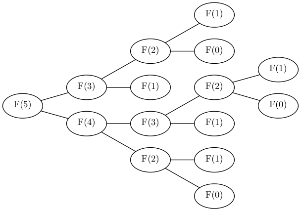
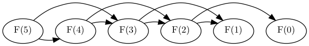

# The Fibonacci Problem

Over 800 years ago Leonardo of Pisa, commonly known as _Fibonacci_, asked the following question:

> Suppose there are a newly born pair of bunnies, one male, one female. Bunnies are able to mate at the age of one month so that at the end of its second month a female can produce another pair of bunnies. Bunnies never die, and a mating pair always produces one new pair (one male, one female) every month from the second month on. How many pairs will there be in one year?

How to express this mathematically. Let's denote the number of rabbits in a given month \\(n\\) as \\(F(n)\\), then our problem is to find \\(F(12)\\).

We can see the total number of bunnies in any given month will equal the sum of number of adult bunnies and baby bunnies in that month:

$$ F(n) = b\_{adult}(n) + b\_{baby}(n) $$

So for example, \\(b\_{new}(n)\\) denote the total pairs of *baby* bunnies in month \\(n\\), and \\(b\_{old}(n)\\) denote the total pairs of *adult* bunnies in month \\(n\\).
To keep track of bunnies, let \\(new\\) denote new bunnies in a given month and \\(old\\) denote bunnies we saw in from previous months:

Observe that the number of adult bunnies in a given month will equal all the adult bunnies from the previous month **plus** all the baby bunnies from the previous month that are now fully grown:

\\[ \\begin{aligned}
b\_{adult}(n) &= b\_{adult}(n-1) + b\_{baby}(n-1) \\\\
              &= F(n-1)
\\end{aligned} \\]

Notice that apart from the initial conditions in the first month, the number of new bunnies in a given month must equal the number of adult bunnies in the previous month:
 
\\[ \\begin{aligned}
b\_{baby}(n) &= b\_{adult}(n-1) \\\\
             &= F(n-2)
\\end{aligned} \\]


So now we can defer to equation 1 to express \\( F \\) in terms of itself:

\\[ \\begin{aligned}
F(n) &= b\_{adult}(n) + b\_{baby}(n) \\\\
              &= F(n-1) + F(n-2)
\\end{aligned} \\]

Now we have a recursive definition to describe how the sequence behaves.
We know that we start in month 1 with 1 pair of bunnies total, and can say that in month zero there are no bunnies:

\\[ \\begin{aligned}
F(0) &= 0 \\\\
F(1) &= 1 \\\\
F(n) &= F(n-1) + F(n-2) \\\\
\\end{aligned} \\]

And we arrive at the famous fibonacci sequence, which is a sequence where every number is equal to the sum of the previous 2 numbers in the sequence and the first two numbers are given as 0 and 1. Because our sequence starts at month zero, We can manually iterate over the first 13 numbers in the sequence to solve get the number of bunnies in month 12 and solve Fibonacci's problem:

\\[ F := 0, 1, 1, 2, 3, 5, 8, 13, 21, 34, 55, 89, 144 \\]

\\[ F(12) = 144 \\]

```go
func Fib(n int) int {
    if n < 2 {
        return n
    }
    
    return Fib(n-1) + Fib(n-2)
}
```

Naively:
(todo)



Cleverly:
(todo)



https://www.geeksforgeeks.org/gcd-and-fibonacci-numbers/

Starting with 5, every second Fibonacci number is the length of the hypotenuse of a right triangle with integer sides, or in other words, the largest number in a Pythagorean triple. The length of the longer leg of this triangle is equal to the sum of the three sides of the preceding triangle in this series of triangles, and the shorter leg is equal to the difference between the preceding bypassed Fibonacci number and the shorter leg of the preceding triangle.

https://www.geeksforgeeks.org/cassinis-identity/
https://www.geeksforgeeks.org/program-check-plus-perfect-number/

fibonaccia as a vector operation, then efficient by https://en.wikipedia.org/wiki/Exponentiation_by_squaring.
