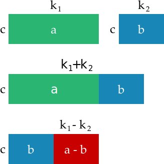

# Divisibility 
What does it mean that a number \\(a\\) is divisible by \\(b\\) ?

what is a number from the point of number theory?
numbers as mathematical objects, once you define what the unit is, a thing is a thing. how many things? (image of things)

### Problem
> how many people before the difference in age is a exactly some multiple of a year?
> is it true that for any four numbers a,b,c,d that there are two of them who difference is divisible by 3?

pigeon hole principle.
It means that \\(a\\) can be represented as \\(b \times q \text{ where } q \in \mathbb{Z} \\)

> note: by this definition \\(0 \\text{ divides } 0 \\) because \\( 0 = 0 \times q \\text{ for all } q\\)
trivial to prove with empty rectang

> show 1 divides any n, so we can consider it trivial. related to primes.

> todo: provide algebraic and then geometric intuitions

imagine the bar as the edge of the rectangle, then a lot of the lemmas become more intuitive.
 imagine as tetris, then more intuitive concept of remainder.

> explain we can assume both positive, because translating from negative to positive is trivial (show)
(same *set* of divisors) 

$$ b \mid a \text{ iff } a = b \times q \text{ where } q \in \\{ ...,-2,-1,0,1,2,-2,... \\} $$
> note this is how to think or visualize whenever you get a divisibility. convert it to its a = mq + r, note that the q is usually the bit we care most about, and it can be "some q"

if \\(b \mid a \\) then \\(b \\mid a \times q \\).

Then also if \\(c \mid a \\) and \\(c \mid b \\) then \\(c \mid a \pm b \\):

\\(a = q \times b + r \\) where \\(0 \le r < b\\)

if \\(r = 0 \\) then \\(a = q \times b \\) and therefore \\(b \mid a \\). todo: explain why r can be zero but not b and not greater than b.

\\(m \bmod b = n \bmod b \\) iff \\(b \mid (m + n) \\)
> todo: prove in both directions
> todo: relate to problem "is it true that for any four distinct numbers a,b,c,d that there are two of them who difference is divisible by 3"

### divisibility by 10
go through simple examples

### divisibility by 2
special case, b = 2. then only 2 possible remainders: 0 and 1.

we have special names for numbers with these remainders: even and odd.

> problem: two classes with m and n students. they join, can we split into pairs if a,b odd/even etc. case both even, both odd, odd/even (use above a-b if same remainder lemma)

for even numbers show that remainder (a - b) mod 2 = (a + b) mod 2

show how can do for products (2 | a + a + a + ... + a) is still divisible by a (above lemma)

build \\( \\pm \\) table and product table for 2

| \\( \pm \\) | 0 | 1 |
|-------------|---|---|
|0            | 0 | 1 |
|1            | 1 | 0 |

`XOR` ?

| \\( \times \\) | 0 | 1 |
|----------------|---|---|
|0               | 0 | 0 |
|1               | 0 | 1 |

`AND` ?

> What is the remainder of \\( 374 \times (419 + 267 \times 38) - 625 \\) when divided by 2?  

trick (explain above) we can operate with their remainders instead of their value.

\\[ \begin{aligned}
&\Big(374 \times (419 + 267 \times 38) - 625 \Big) \bmod 2 \\\\
&= \Big((374 \bmod 2) \times \big( (419 \bmod 2) + (267 \bmod 2) \times (38 \bmod 2)\big) - (625 \bmod 2)\Big) \bmod 2 \\\\
&= \Big(0 \times ( 1 + 1 \times 0) - 1\Big) \bmod 2 \\\\
&= \Big(0 - 1\Big) \bmod 2 \\\\
&= 1
\end{aligned} \\]

### Congruence

> what is the remainder of \\( 17 \times (12 \times 19 + 5) - 23 \\) when divided by 3?

can substitute with congruent numbers (not just remainder, e.g. -1 is congruent to 2 modulo 3)
### All that remains

two numbers \\(a\\) and \\(b\\) are **congruent modulo \\(m\\)** if they have the same remainder when divided by \\(m\\)

\\(a \equiv b \mod m\\)

as we discuess, \\(a \equiv b (\bmod m)\\) iff \\(a-b\\) is divisible by \\(m\\)

> note: iff can be counterintuitive if you read as a conditional, another way is to treat it as a double sided implication, i.e:
if \\(a \equiv b (\bmod m)\\) then \\(a-b\\) is divisible by \\(m\\) and vica versa

Note that then \\(a \equiv b (\bmod m)\\) iff \\((a +k \times m) \equiv b (\bmod m)\\)

This means that if \\(a = m \times q + r\\) then \\(a \equiv r (\bmod m)\\)

### addition of constant

> if \\( a \equiv b (\\bmod m) \\) then \\(a + c \equiv b + c (\\bmod m) \\) for any \\(c\\)
prove visually, prove algebraicly, prove with lemma \\(m \mid (a-b)\\) and \\(a+c) - (b-c) = a-b\\)

### addition
> if \\( a \equiv b (\\bmod m) \\) and \\( c \equiv d (\\bmod m) \\)  then \\(a + c \equiv b + d (\\bmod m) \\)
"congruence is preserved under addition"

> what is \\(14 + 41 + 20 + 13 + 29 \\) when divided by 4

### multiplication
> if \\( a \equiv b (\\bmod m) \\) and \\( c \equiv d (\\bmod m) \\)  then \\(a \times c \equiv b \times d (\\bmod m) \\)
"congruence preserved under multiplication"

> what are the last two digits of \\(99^{99}\\)
trick \\(99 \equiv -1 (\bmod 100)\\)

> is 3475 divisible by 3?

### modular addition table
is subtraction possible?
> suppose we have two numbers \\(a\\) and \\(b\\). Is there \\(x\\) such that \\(a + x \equiv b (\bmod 7) \\)? 

simple proof, each row conatins each possible remainder. pigeonhole principle for a and x must be one of the rows/cols, there will be a b
prove not just true for 7, but any module

### modular multiplication table
the ones! there are no ones (except 1...) unless there are fractions (rational numbers) or modular arithmetic 
- for mod 7, same logic, division must exist (where a != 0), but no... for mod 6

modular division... is more complicated... (diaphantine equations...)

is it bad? well, if math was about computing things like the problems thus far... yes. but things being hard can be good too (cryptography!)

# Binary (quickie) article
> show that \\( a\bmod b \\) is same the last digit as \\(a_{\text{base }b}\\)
in this way there is a deeper relationship to bases (radix) and remainders / divisibility

how to prove that binary system can represent every number and that it is a bijection? (find proof by induction)

> Problem: how many bits required to represent a given number \\(a\\)

show that \\(2^n) requires \\(n+1\\) bits and is the smallest number requiring that many bits:
prove \\(2^n - 1 = 2^{n-1} + 2^{n-2} + ... + 2^0 \\) which has a length of n.

then show the answer is:

largest \\(n\\) such that \\(2^{n-1} \le a\\)
 
show how this relates to logarithms (and the shift proof in gopher forth)

number of bits is \\(\lfloor \log_2{a} \rfloor + 1\\)

(can prove directly, observing that the floor operator is same as "largest integer n that is less than or equal to, pretty cool, gives a new intuition to the floor/round down operator)
