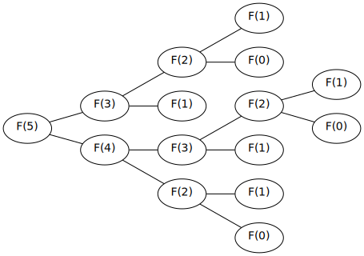
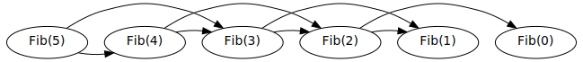

# The Fibonacci Problem - Part I

### Introduction
> todo

### The Problem
Over 800 years ago Leonardo of Pisa posed a question that went something like this:

> Suppose we have a newly-born fluffy. Fluffies are magical creatures - they never die and when they are one month old they become adult fluffies. One month after a fluffy has become an adult it will produce another newly-born fluffy - and then again every month after. Given this process repeats for every newly-born fluffy, how many fluffies will there be after one year has passed?

If we then denote the number of fluffies in a given month \\(n\\) as \\(F\_n\\) then our task is to find \\( F\_{12} \\).

As a start, we make the observation that the number of fluffies in any given month is the sum of the adult fluffies and baby fluffies in that month. If we denote the number of **a**dult fluffies and **b**aby fluffies in month \\(n\\) as \\(a\_n\\) and \\(b\_n\\) respectively, we have that:

$$ F\_n = a\_n + b\_n $$

Let's first reason about the number of **adult** fluffies in a given month \\(n\\). Since fluffies never die, all the adult fluffies from the previous month \\( (n-1) \\) will still exist this month \\(n\\). Also, fluffies become adults after only one month, this means that all the baby fluffies from the previous month have now become adult fluffies this month. 

Thus we have that the number of adult fluffies in a given month \\(n\\) will be the sum of the adult fluffies and baby fluffies from the previous month \\((n-1)\\):

\\[ \\begin{aligned}
a\_n &= a\_{n-1} + b\_{n-1} & \\\\
     &= F\_{n-1}            & (\text{above definition of } F\_n)
\\end{aligned} \\]

Next, let's examine the **baby** fluffies in a given month. Because each adult fluffy from the previous month will produce a single baby fluffy the next month we have that the number of baby fluffies in a any given month must equal to the number of adult fluffies in the previous month:
 
\\[ \\begin{aligned}
b\_{n} &= a\_{n-1} \\\\
       &= F\_{n-2}   & (\text{above definition of } a\_n)
\\end{aligned} \\]

With this improved understanding of \\(a\_n\\) and \\(b\_n\\) we can re-write our definition of \\(F\_n\\):

\\[ \\begin{aligned}
F\_n &= a\_{n} + b\_{n} \\\\
     &= F\_{n-1} + F\_{n-2}
\\end{aligned} \\]

This means that the number of fluffies in a given month is determined by the number of fluffies in the previous two months. Thus if we know the number of fluffies in the first two months we can determine the number of fluffies in any subsequent month. We know that in the first month that we start with a single fluffy, that is \\(F\_1 = 1\\), and we can say that before the first month we had no fluffies at all so we know that \\(F\_0 = 0\\). 

This gives us all the pieces we need to define the \\(F_n\\) with a recursive relation:

\\[ \\begin{aligned}
F\_0 &= 0 \\\\
F\_1 &= 1 \\\\
F\_n &= F\_{n-1} + F\_{n-2} \\text{ where } n > 1
\\end{aligned} \\]

To solve Fibonacci's problem then we can use simply use the definition to compute from \\(F_0\\) to \\(F\_{12}\\):

\\[ 0, 1, 1, 2, 3, 5, 8, 13, 21, 34, 55, 89, 144 \\]

\\[ \therefore F_{12} = 144 \\]

This famous sequence is known as the **fibonacci sequence** and the \\(n^{th}\\) number in the sequence is known as the \\(n^{th}\\) fibonacci number.

### Finding \\(F\_n\\) for arbitrary \\(n\\) 

Suppose then you are tasked with implementing a function to return \\(F_n\\) for arbitrary \\(n\\). To compare different implementations we will first define our interface as a function which takes an integer \\(n\\) and returns an integer:

```go
// fibonacci.go

type Fib func(n int) int
```

As a first implementation itt is tempting to codify our recursive definition directly as:
 
```go
// fibonacci.go

func FibNaive(n int) int {
    if n < 2 {
        return n
    }
    
    return FibNaive(n-1) + FibNaive(n-2)
}
```

When I ran some benchmarks for this naive implementation for various values of \\(n\\) and got the following:
 
| \\( n \\)   | `Naive`           |
|-------------|-------------------|
| \\( 12 \\)  | 1,062 ns/op       |
| \\( 40 \\)  | 816,681,704 ns/op |
| \\( 90 \\)  | way too long      |

We can see that our solution is not scaling well at all - in fact for \\(n=90\\) my mac ran out of memory. What's going on here? We can "plug and chug" through our solution for \\(n = 5\\) to get a feel for what is happening:

\\[ \\begin{aligned}
F\_5 &= F\_3 + F\_4 \\\\
    &= (F\_1 + F\_2) + (F\_2 + F\_3) \\\\
    &= (1 + (F\_0 + F\_1)) + ((F\_0 + F\_1) + (F\_1 + F\_2)) \\\\
    &= (1 + (0 + 1)) + ((0 + 1) + (1 + (F\_0 + F\_1))) \\\\
    &= (1 + (0 + 1)) + ((0 + 1) + (1 + (0 + 1))) \\\\
    &= 5
\\end{aligned} \\]

Here we can see the problem - our solution seems to do a lot of duplicate work. We can see that in the case for \\(n=5\\) we are computing \\(F\_2\\) three times! This is even more apparent when we visualize our algorithm with a graph:

<p style="text-align: center; margin: 50px 0;">

</p>

Our graph shows our algorithm behaves like a tree and seems to grow in an exponential manner. In fact we can see that as \\(n\\) increases our tree will have a height of approximately \\(n\\), with each layer having approximately double the nodes of the above layer. Since the addition operations happen in the leaves, we can see there will be \\(2^n\\) numbers to add up! Also each node in the entire graph roughly corresponds to another function call added to our call-stack which means we are taking exponential space as well! 

> It's no wonder then that I ran out of memory trying to perform `Fib(90)`. \\(2^{90}\\) is an obscenely large number and too much for my mac to handle.

### Remember what you saw here
The results of our first implementation do not seem to coincide with our own experience when we followed the recursive definition to compute the fibonacci numbers by hand. This is because we did not need to perform duplicate computation, but rather we re-used our previous computation. The graph representation for our manual approach is then:

<p style="text-align: center; margin: 50px 0;">

</p>

To move our implementation more in alignment with this linear graph, we will cache our intermediate results so that we do not have to recompute them:

```go
// fibonacci.go

func FibCached(n int) int {
  return FibCachedHelper(n, make(map[int]int))
}

func FibCachedHelper(n int, cache map[int]int) int {
  if n < 2 {
    return n
  }

  a, cached := cache[n-2]
  if !cached {
    a = FibCachedHelper(n-2, cache)
  }

  b, cached := cache[n-1]
  if !cached {
    b = FibCachedHelper(n-1, cache)
  }

  result := a + b
  cache[n] = result

  return result
}
```

In our implementation you can see that in order to adhere to our interface we used a helper function which takes a cache as an argument. We then check this cache before performing any recursive calls and we cache our results after each addition. 

When I now run the benchmarks I get:

| \\( n \\)   | `Naive`           | `Cached`     |
|-------------|-------------------|--------------|
| \\( 12 \\)  | 1,062 ns/op       | 1,120 ns/op  |
| \\( 40 \\)  | 816,681,704 ns/op | 7,331 ns/op  |
| \\( 90 \\)  | way too long      | 14,488 ns/op |

This improved implementation has made calculating `Fib(90)` tractable and the performance appears to be scaling linearly with our input much like our graph suggested, and indeed our algorithm now gone from order \\(O(2^n)\\) to \\(O(n)\\).

> When I first implemented the cached version I used a global variable for the cache and my benchmarks were unreasonably fast. This is because the first time golang executed `Fib` the final value was cached and available for subsequent executions. So calculating `Fib(90)` was as fast as cache lookup! Let that be a lesson to be careful of shared memory when benchmarking.


### Can we do better? Tail recursion
> todo

### Strict tail recursion
> todo

### Summary
> todo
